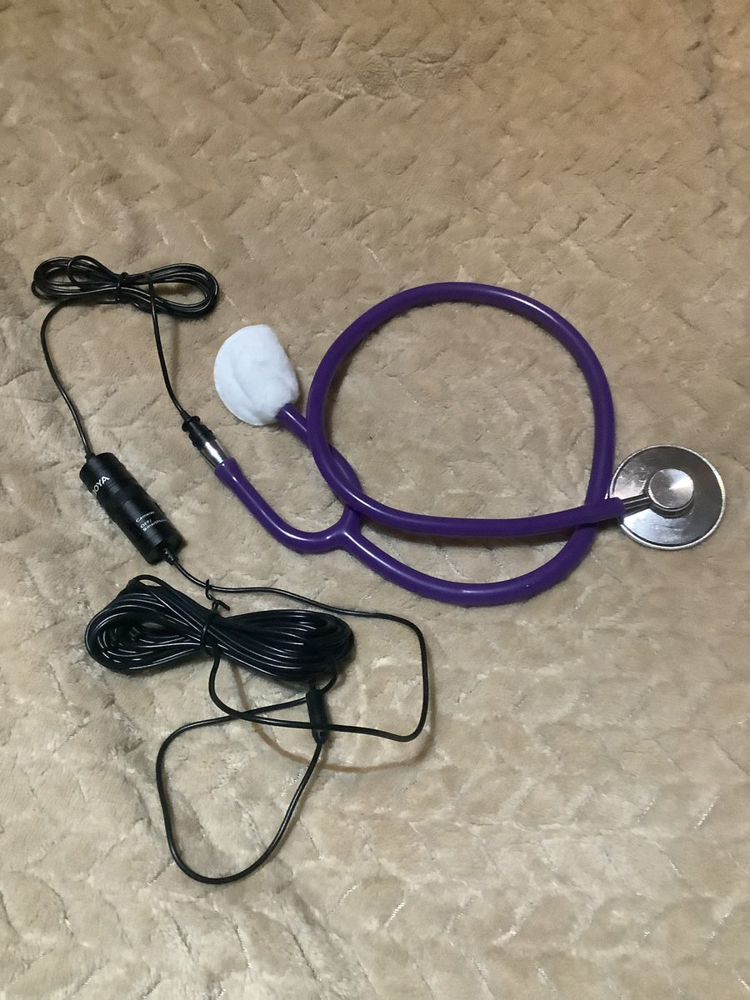
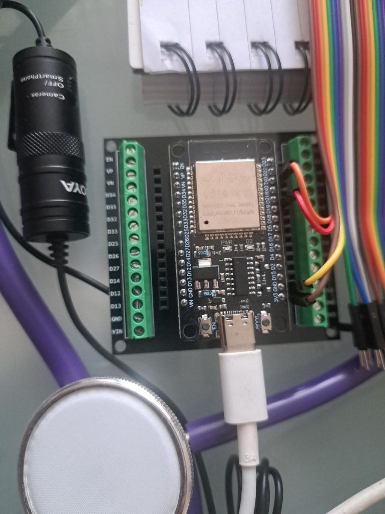
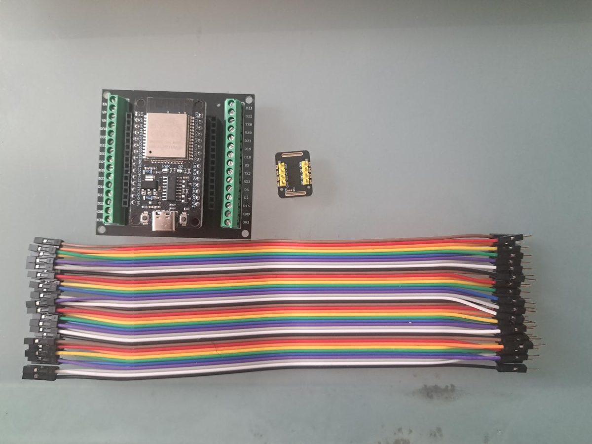
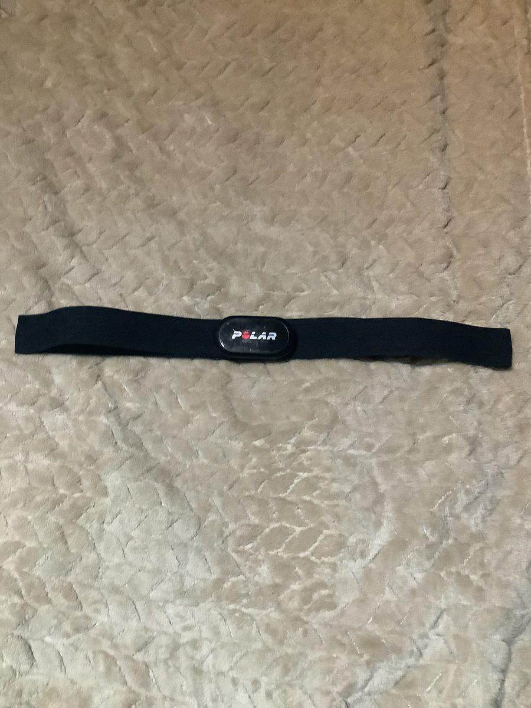

# Multimodal digital patient demonstrator

Offline research demonstrator for keeping these layers distinct:

1. **Latent state** exported from Pulse or another physiology model.
2. **Subsystem outputs** such as vascular pressure/flow from OpenBF.
3. **Synthetic observations** only when produced by an explicit sensor forward model.
4. **Recorded sensor observations** such as H10 ECG, contact PPG, iPad RGB, and exploratory PCG.
5. **Interpretations and forecasts**, including camera estimator outputs and TimesFM predictions.

The dashboard is a replay and inspection tool. Pulse and OpenBF outputs are loaded through the CSV exchange adapter; the dashboard does not run Pulse, OpenBF, or MCX directly, and it makes no clinical claims. The shared cursor applies to one selected scenario and marks the nearest recorded value in each layer. It does not imply that independently acquired scenarios share a physiological clock.

## Acquisition hardware

These photos show the sensors behind the channel and source names used in the exchange CSV (for example `BOYA_BY_M1_through_stethoscope_tubing`, `MAX30102_IR`, and the `H10` rate estimates). They show the rig used for the private research session. No recordings are included in this repository, and the public demonstration uses synthetic data only.

| | |
|:--|:--|
|  |  |
| BOYA BY-M1 microphone coupled to a stethoscope through its tubing (the exploratory PCG channel). | ESP32 board on a terminal breakout, shown next to the microphone and stethoscope chestpiece. |
|  |  |
| ESP32 board, a MAX30102 optical sensor board, and the jumper cables used to connect them. | Polar H10 chest strap, the heart-rate reference. |

## Local setup (Linux with NVIDIA CUDA)

Use a separate virtual environment; do not install these packages into the repository's Julia environment or global Python.

```bash
cd multimodal_demo_next
python3 -m venv .venv
source .venv/bin/activate
python -m pip install --upgrade pip
python -m pip install -e '.[cuda]'
```

Start the local dashboard:

```bash
streamlit run app.py --server.address 127.0.0.1 --server.port 8501
```

Convert an existing Pulse CSV/CSV.GZ trajectory to the exchange format (from the project root):

```bash
python pulse_export.py \
  <local-pulse-export.csv.gz> \
  work/pulse_normotensive.csv \
  --scenario pulse_normotensive_steady
```

This exports available physiological variables as `layer=latent`, with the Pulse source and scenario preserved. Available state variables include heart rate, pressure, cardiac output, stroke volume, systemic resistance and blood volume, depending on the source trace. Pulse exports from other runs may be steady-state or protocol-specific trajectories; they are not automatically forecasts for a recorded participant.

### Pulse plus OpenBF cycle example

The research workflow can produce a small bridged example:

```text
work/pulse_openbf_normotensive_cycle.csv
```

It contains one 0.84 s normotensive Pulse representative cycle (`layer=latent`) and the corresponding saved Stage 5 OpenBF distal external-carotid pressure and flow (`layer=subsystem`). The OpenBF converged-cycle timestamps are shifted onto the Pulse cycle endpoint using their common cycle period; the file records this as `derived_alignment`, including the method and model provenance. It is a coupled cardiac-cycle comparison, not a full time-domain Pulse/OpenBF co-simulation. OpenBF pressure is converted from Pa to mmHg and flow from m³/s to mL/s. The final sampled spatial column is used, matching the project's distal-site analysis.

To regenerate it from the saved model outputs:

```bash
python bridged_cycle_export.py \
  --openbf-case normotensive_arm1_inlet_only \
  --output work/pulse_openbf_normotensive_cycle.csv
```

Upload that CSV in the viewer and keep both **Latent model state** and **Subsystem model outputs** selected. The Pulse aortic inflow/pressure and OpenBF distal pressure/flow then appear as distinct source layers on the same cycle-relative timeline. This file contains no MCX output and no synthetic RGB, rPPG, contact PPG, ECG, or PCG. Those channels must only be added after their respective forward models produce actual outputs; the `synthetic_observation` layer is reserved for those outputs, not placeholders.

When a Pulse exchange CSV is loaded, choose its simulation scenario. The renderer below the plots interpolates supported Pulse fields to the scenario cursor only when their source samples bracket that time within 0.1 s. It records per-field source timestamps, offsets, and supplied/derived/unavailable provenance. A separate **Observed HR cadence** mode is available when sensor/estimate bpm series are loaded; it takes only the selected HR series and does not infer or fill other physiology.

When recorded `iPad8_RGB` camera means are present, the optical observation renderer can inspect each take. It displays the measured red/green/blue ROI means, a clearly declared per-channel mean-normalized transform, and stored H10/CHROM/POS/Y rate series when available. The tissue/camera diagram is a static schematic; no skin-tone model or synthetic pulsation is applied. The viewer does not contain raw video, and it does not currently synthesize MCX observations. Reference-informed candidate series are visually marked as diagnostics.

When one-second `pcg_band_rms_20_400hz_ch1/ch2` features are present, the PCG/acoustic renderer shows the stethoscope–BOYA BY-M1–computer path, the two-channel band-limited acoustic envelope, and H10 rate context beside stored acoustic spectral-rate features. `pcg_rate_export.py` can add a numeric-only spectral screen from the external WAV: 20–200 Hz band-pass, 48–52 Hz suppression, Hilbert amplitude envelope resampled to 500 Hz, 30 s trailing Welch windows stepped every second, and a 30–300 events/min search. It exports the reference-blind dominant and second-ranked spectral components plus an explicitly H10-guided near-rate diagnostic candidate. These are periodicities in the amplitude-envelope spectrum, not detected individual acoustic events or S1/S2. The diagnostic selects an acoustic spectral peak within ±12 events/min of the median H10 rate over the same preceding 30 s window. WAV samples and spectra are not copied into the exchange CSV or loaded by the dashboard. The WAV start is metadata-derived, so cross-device alignment is approximate and not hardware-synchronised; this analysis does not provide beat-level timing or S1/S2 labels.

To augment the six-session CSV locally:

```bash
python multimodal_demo_next/pcg_rate_export.py \
  --wav <local-acoustic-recording.wav> \
  --timeline work/session_timeline.csv \
  --output work/session_timeline_with_acoustic_features.csv
```

To create a dashboard file from a six-interval recording, provide the local capture archive and matching continuous sensor streams:

```bash
python harmonize_six_take_research.py \
  --research-root <local-capture-archive> \
  --output work/six_interval_session.csv \
  --manifest work/six_interval_session_manifest.json
```

Upload `work/six_interval_session.csv` and select a take such as `recovery_1`. The exchange file contains sensor observations and derived estimates; the sidecar records timing and processing provenance. Keep source recordings outside this application directory.

To replay all six real takes on one **session-relative iPad master timeline**, convert that per-take file using its timing manifest:

```bash
python session_timeline_export.py \
  --input work/six_interval_session.csv \
  --manifest work/six_interval_session_manifest.json \
  --continuous-h10-ecg <local-continuous-H10-ECG.csv> \
  --continuous-esp32 <local-continuous-ESP32.csv> \
  --pcg-wav <local-acoustic-recording.wav> \
  --output work/session_timeline.csv \
  --output-manifest work/session_timeline_manifest.json
```

This preserves each interval as `take_id` and `take_time_s`, while `time_s` is shifted by the iPad wall-clock start offset from the first take. It adds the continuous H10-derived RR trajectory and continuous ESP32 ECG/PPG streams when their source files are supplied. H10 raw ECG remains available inside the iPad capture intervals; its row-level host timestamps repeat across ECG sample blocks, so the continuous export uses the derived rate trajectory for coarse session context rather than drawing those samples as a dense, synchronized ECG waveform. The WAV is processed locally into one-second 20–400 Hz RMS features only; the raw audio file is not copied into the exchange CSV. Its timestamp uses the file modification time minus WAV duration and is marked `derived_alignment`: the endpoint differs from the ESP32's final host timestamp by about 0.11 s, but there is no hardware marker, so this supports second-scale envelope inspection only, not beat-level ECG-PCG timing. The sidecar records capture intervals, actual gaps, and a broad exercise/setup transition window. `protocol_time_s=0` is the first Recovery 1 capture start, a proxy rather than a measured exercise-end event. The dashboard's TimesFM section selects one take at a time, avoiding interpolation across capture/intervention gaps. This session timeline contains real observations and estimates only: Pulse remains a separate modeled episode, and no latent participant state is inferred.

The first TimesFM forecast downloads Google's TimesFM 3 checkpoint from Hugging Face. The data viewer itself works without downloading or loading the model. The shared time cursor limits the forecast history; because irregular series may not have a sample exactly at the cursor, the app reports the latest common sampled time used as the actual forecast origin. The checkpoint license is non-commercial/non-production; see the official [TimesFM repository](https://github.com/google-research/timesfm) and [model card](https://huggingface.co/google/timesfm-3.0-pytorch).

### First mechanistic forecast experiment

The frozen evaluation design and candidate grid are in [`docs/MECHANISTIC_FORECAST_PROTOCOL.md`](docs/MECHANISTIC_FORECAST_PROTOCOL.md). The generator uses one unchanged StandardMale baseline, the six declared Exercise intensities, three durations and four cessation-to-capture delays to produce 72 Pulse HR trajectories. It does not read H10. The forecast tab compares measured H10 RR-derived HR over 0–60 s with TimesFM and, when the ensemble is present, a weighted Pulse projection over 31–60 s. Persistence and a 10-second linear trend are reference baselines. All methods are scored at the same measured held-out H10 timestamps. H10 context weights Pulse candidates only at 5, 10, 15, 20, 25 and 30 s. The weighted median and 10th–90th percentile range are displayed with effective ensemble size and the highest-weight candidate. This is an HR-constrained projection, not full state inference or an individualized forecast.

To generate the frozen Recovery 1 candidate ensemble, run from this directory:

```bash
python generate_exercise_recovery_ensemble.py --workers 4
```

The script reads the local Pulse install and a frozen baseline checkpoint supplied at runtime; it writes the candidate exchange CSV, a run manifest and per-candidate logs. Build the comparison bundle with:

```bash
python combine_pulse_candidate_branch.py
```

The research-session bundle (`six_take_with_pulse_hr_candidates.csv`) contains real recordings and is kept outside this repository (it is gitignored). For a public-safe equivalent, generate the synthetic file with `public_demo/generate_synthetic_session_csv.py`. It reuses the same H10-independent 72 trajectories for Recovery 1, 2 and 3; each recovery is weighted separately using its own H10 context. These are repeated segments, not independent participants. Pass `--take-ids recovery_1` for a Recovery 1 only bundle. Keep these rows at `episode_relationship=comparable_scenario`: the dashboard excludes them from the real-session timeline and uses them only in Forecast comparison. OpenBF is not used for this HR target; it can be added later for a distinct vascular waveform or synthetic-observation target.

## Circulation renderer

The dashboard embeds a local adapted copy of the circulation twin below the plots. In **Pulse model state** mode, it selects named Pulse state at the scenario cursor and passes a read-only snapshot plus source trajectories to the renderer. **Inspect** repeats the latest complete Pulse aortic-inflow cycle (fresh within 1.5 current beat periods); **Play from cursor** advances through the episode and samples each field at a shared renderer playhead using the same 0.1 s freshness rule. In **Observed HR cadence** mode, the selected sensor/estimate HR drives beat cadence only; the heart/vessel illustration is schematic, flow particles and pressure/resistance encodings are disabled, and missing physiology remains unavailable. Playback interpolates only across observed-HR brackets no wider than 2.5 s and stops at larger gaps or episode end. In both modes the upper dashboard charts stay at the playback-origin cursor: orange dashed marks the fixed inspection cursor and blue solid tracks the renderer playhead.

## Exchange CSV

One row per time point and channel:

| Column | Meaning |
|---|---|
| `time_s` | Seconds from a shared interval origin; monotonically increasing within each channel/source series. Keep the same clock mapping across modalities. |
| `channel` | Stable feature name, e.g. `hr`, `ppg_ir_ac`, `rppg_chrom_winner`, `rppg_chrom_candidate`, `pcg_envelope`. |
| `value` | Numeric measurement. |
| `unit` | Unit, e.g. `bpm`, `a.u.`, `mmHg`. |
| `layer` | Exactly one of `latent`, `subsystem`, `synthetic_observation`, `sensor`, `estimate`, `forecast`. |
| `source` | Provenance, e.g. `Pulse`, `H10`, `MAX30102_IR`, `iPad_CHROM`. |
| `scenario` | Optional scenario or take identifier. |
| `episode_id` | Optional recording/simulation episode identifier; defaults from `scenario` when loaded. |
| `clock_provenance` | Optional timestamp/clock source. Missing values are shown as unknown, never inferred as synchronized. |
| `alignment_status` | Optional `master_clock`, `shared_clock`, `wall_time_aligned`, `derived_alignment`, `unaligned`, or `unknown`. |
| `episode_relationship` | Optional `same_episode`, `comparable_scenario`, `unrelated`, or `unknown` relative to the episode being compared. |

Do not label an H10-guided diagnostic camera candidate as an estimator output. Use `layer=estimate` and make the channel/source explicitly diagnostic. Observed, simulated, estimated, and forecast values remain visibly distinct.

## TimesFM forecast behaviour

The first forecast control operates on user-selected `bpm` channels only. It aligns them on their shared time overlap on a one-second grid, linearly interpolating the at-most-three missing points between the exploratory four-second camera/PPG window estimates. It standardizes each channel using the observed context only, makes a joint multivariate forecast, then reverses the scaling for display. This is an empirical continuation of observed features. It is not an action-conditioned physiology model; Pulse remains the source for intervention-conditioned latent trajectories.

## Current scope

- CSV replay with separate latent, subsystem, synthetic-observation, sensor, estimate and forecast panels.
- One scenario-relative time cursor with nearest-sample readouts and full clock/alignment provenance. It does not align independent episodes.
- Three.js renderer has separate Pulse-state and observed-HR-cadence inputs; neither mode performs hidden state inference or substitutes one branch for the other.
- Optional joint TimesFM forecast for selected `bpm` channels.
- PCG observation panel for exported stereo one-second band-RMS features, with separately labelled H10 reference context and explicit approximate-alignment/temporal-resolution caveats.
- The retained example CSV contains real physiological measurements and is not anonymized. It contains no raw WAV or video; review the measurements separately before any public distribution.
- Pulse and saved OpenBF outputs can be exported together as a phase-aligned cardiac-cycle replay. The dashboard still does not execute either model.
- MCX-derived optical outputs and synthetic ECG/PPG/rPPG/PCG remain future forward-model integrations; no synthetic observation is fabricated by the viewer.
